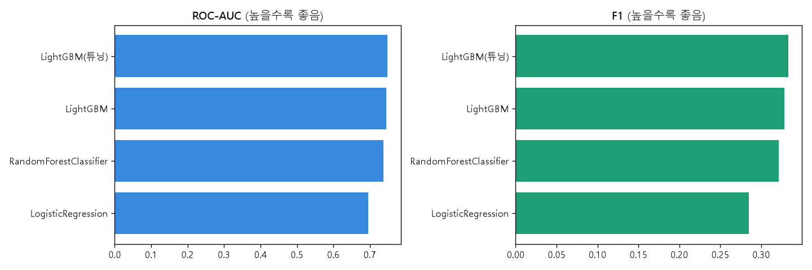

# 서울 상권 폐업예측 — ML 모델 벤치마크 보고서

**작성일**: 2026-08-30
**데이터**: `modeling_dataset_refined_pjw.csv` (SKN35-2nd-3Team 프로젝트, pjw 팀원 전처리본)
**목적**: 폐업확률 예측 모델 후보를 실데이터 기준으로 학습·비교하고, 최종 상권·업종 지표 설계에 쓸 모델을 선정하기 위한 벤치마크 기록

---

## 1. 프로젝트 개요

서울시 소상공인 매장의 향후 폐업 여부(`is_closed_next`)를 예측하는 이진분류 문제를
다룬다. 최종 목표는 이 폐업확률을 상권(행정동)·업종 단위로 집계해 0~100점 "생존점수"
지표로 서비스에 노출하는 것이며, 이 보고서는 그 앞 단계인 **폐업확률 모델 자체의
비교·선정** 과정을 정리한다.

작업은 팀의 실제 저장소 구조(`src/project_2nd/models/ml/`)를 그대로 흉내낸
`ml_dryrun/` 프로젝트에서 진행했다 — 팀 본 저장소에 영향 없이 독립적으로 실험하기 위함이다.

## 2. 데이터

| 항목 | 값 |
|---|---|
| 파일 | `modeling_dataset_refined_pjw.csv` |
| 행 수 | 1,889,582 |
| 컬럼 수 | 37 |
| 타깃 | `is_closed_next` (0/1) |
| 양성 비율 | 10.65% (불균형 데이터) |
| 검증 방식 | 사전 배정된 `fold` 컬럼 기준 5-fold (매장 단위로 배정되어 있어 데이터 누수 없음) |

**제외한 컬럼**
- `snapshot_date`, `store_id`, `fold`, `is_closed_next` — 식별자/타깃/검증키
- `industry_jung_name`, `industry_name` — 각각 `industry_jung_code`, `industry_code`와
  카디널리티가 완전히 같은 1:1 중복 컬럼(코드↔이름 매핑일 뿐)이라 제외. 넣어봤자
  원핫 차원만 두 배로 늘고 정보는 늘지 않는다.

**범주형 피처(6개)**: `industry_dae_code`, `industry_group`, `industry_jung_code`,
`industry_code`, `gu_name`, `floor_category`

**결측치**: 로드 직후 점검한 결과 `industry_specialization_300m`(소수), 특히
`dong_industry_count_growth`(약 40,188/300,000행, 첫 스냅샷은 이전 시점이 없어
증가율 계산이 불가능한 구조적 결측)에서 결측이 발견됨 → 수치형 컬럼에 중앙값
대치(`SimpleImputer(strategy="median")`)를 학습 fold 내부에서만 적용해 처리.

## 3. 구현 계획 (단계별 진행)

| 단계 | 내용 | 상태 |
|---|---|---|
| 1 | 가짜 데이터로 파이프라인 코드 검증 (스키마 흉내, 인코딩→5-fold→3모델→평가지표) | ✅ 완료 |
| 2 | 팀원(pjw) 실측 결과 확인 — LightGBM 기존 벤치마크(ROC-AUC 0.748, 클래스가중치 미적용) | ✅ 확인 |
| 3 | 실데이터(`modeling_dataset_refined_pjw.csv`) 확보 후 파이프라인 스키마 재조정 | ✅ 완료 |
| 4 | 실데이터 15만행(7.9%) 표본으로 3모델 1차 검증 | ✅ 완료 |
| 5 | 실데이터 전체(189만행) 3모델(LogReg/RF/LightGBM) 최종 실행 | ✅ 완료 |
| 6 | LightGBM 하이퍼파라미터 그리드서치(8조합) | ✅ 완료 |
| 7 | 신규 모델 후보 CatBoost 시도 | ⚠️ 시도했으나 환경 문제로 제외 |
| 8 | 최종 비교 및 시각화, 보고서 작성 | ✅ 완료 (본 문서) |
| 9 | 상권·업종 지표 집계 로직 설계·구현 | ⏳ 다음 단계 |

## 4. 코드 구성 설명

```
ml_dryrun/
├── src/project_2nd/models/ml/
│   ├── generate_fake_dataset.py     가짜 데이터 생성 (1단계, 파이프라인 검증용)
│   ├── train_and_evaluate.py        가짜 데이터로 3모델 학습·평가 (1단계)
│   ├── train_and_evaluate_real.py   실데이터로 3모델(LogReg/RF/LightGBM) 학습·평가 (4~5단계)
│   ├── train_catboost.py            CatBoost 단독 실행 스크립트 (7단계, 참고용으로 보존)
│   ├── tune_lightgbm.py             LightGBM 하이퍼파라미터 그리드서치 단독 스크립트
│   ├── build_notebook.py            아래 노트북을 nbformat으로 조립하는 빌더
│   └── execute_notebook.py          노트북을 헤드리스로 실행(nbclient), 실패해도 중간 결과 저장
├── model_comparison.ipynb           6~7단계 실행 결과가 그대로 담긴 노트북 (표+그래프 출력 포함)
├── data/features/modeling_dataset_fake.csv   1단계 가짜 데이터
├── results/
│   ├── benchmark_results.csv              가짜 데이터 결과
│   ├── benchmark_results_real.csv         실데이터 15만행 표본 결과
│   ├── benchmark_results_real_full.csv    실데이터 전체 3모델 결과
│   ├── final_model_comparison.csv         최종 5개 구성 비교표
│   └── final_model_comparison.png         최종 비교 막대그래프
└── REPORT.md                        본 문서
```

**핵심 로직 요약 (`train_and_evaluate_real.py`)**
1. CSV 전체 로드, 제외 컬럼 필터링, 범주형 결측치를 `"결측"` 문자열로 채움
2. `fold` 컬럼 값(0~4)마다 해당 fold를 테스트로, 나머지를 학습으로 분리
3. 모델별 전처리 파이프라인
   - LogisticRegression: 수치형 중앙값 대치 + 표준화, 범주형 원핫 (`class_weight="balanced"`)
   - RandomForest: 수치형 중앙값 대치만, 범주형 원핫 (`class_weight="balanced"`)
   - LightGBM: 결측치 처리 불필요(자체 지원), 범주형은 `category` dtype으로만 변환,
     `scale_pos_weight`를 학습 fold의 neg/pos 비율로 계산해 적용
4. fold마다 PR-AUC/ROC-AUC/Precision/Recall/F1/Brier 계산 후 5-fold 평균

## 5. 모델 비교 결과

### 5-1. 실데이터 15만행 표본 (1차 검증, 전체의 7.9%)

| 모델 | ROC-AUC | F1 | Precision | Recall | 학습시간 |
|---|---|---|---|---|---|
| LogisticRegression | 0.691 | 0.286 | 0.186 | 0.615 | 0.5분 |
| RandomForest | 0.724 | 0.347 | 0.290 | 0.431 | 6.0분 |
| LightGBM | 0.725 | 0.324 | 0.233 | 0.536 | 0.4분 |

### 5-2. 실데이터 전체 189만행 — 최종 결과



| 순위 | 모델 | PR-AUC | ROC-AUC | Precision | Recall | F1 | Brier | 학습시간 |
|---|---|---|---|---|---|---|---|---|
| 🥇 | **LightGBM (튜닝)** | **0.3822** | **0.7481** | 0.2332 | 0.5830 | **0.3331** | **0.1877** | 2.8분 |
| 🥈 | LightGBM (기본값) | 0.3760 | 0.7461 | 0.2282 | 0.5875 | 0.3287 | 0.1900 | 2.4분 |
| 🥉 | RandomForest | 0.3638 | 0.7377 | 0.2225 | 0.5792 | 0.3215 | 0.1972 | 73.1분 |
| 4위 | LogisticRegression | 0.2346 | 0.6960 | 0.1847 | 0.6216 | 0.2847 | 0.2192 | 3.3분 |

**LightGBM 하이퍼파라미터 그리드서치 (8조합)**

| num_leaves | min_child_samples | feature_fraction | ROC-AUC | F1 |
|---|---|---|---|---|
| **63** | **50** | **0.8** | **0.7481** | **0.3331** |
| 63 | 20 | 0.8 | 0.7481 | 0.3331 |
| 63 | 50 | 1.0 | 0.7475 | 0.3324 |
| 63 | 20 | 1.0 | 0.7474 | 0.3323 |
| 31 | 50 | 0.8 | 0.7465 | 0.3292 |
| 31 | 20 | 0.8 | 0.7465 | 0.3290 |
| 31 | 50 | 1.0 | 0.7462 | 0.3288 |
| 31 | 20 | 1.0 | 0.7461 | 0.3287 |

`num_leaves=63`(기본 31의 2배)인 조합이 항상 상위권 — 트리를 조금 더 복잡하게
허용하는 쪽이 이 데이터엔 유리했다. `min_child_samples`/`feature_fraction`의 영향은
미미했다.

### 5-3. 참고 — 팀원(pjw) 기존 벤치마크와의 비교

pjw 팀원이 사전에 실행한 LightGBM(클래스 불균형 보정 없음, 5-fold, `original`/`refined`
데이터셋 기준)과 비교하면:

| | pjw의 LightGBM (가중치 없음) | 본 보고서의 LightGBM (튜닝) |
|---|---|---|
| ROC-AUC | 0.748 | 0.748 (거의 동일) |
| Precision | 0.764 | 0.233 |
| Recall | 0.172 | 0.583 |
| F1 | 0.281 | 0.333 |

ROC-AUC(판별력 자체)는 두 버전이 거의 같지만, **`scale_pos_weight`로 클래스 불균형을
보정한 본 버전은 재현율(Recall)이 3.4배 높다** — 실제 폐업 매장을 더 많이 잡아낸다는
뜻이라, 폐업 위험을 놓치는 비용이 더 큰 실서비스 목적에는 이쪽이 유리하다.

## 6. 트러블슈팅 로그

작업 중 실제로 겪은 문제와 대응을 시간 순으로 기록한다 — 나중에 같은 문제를
다시 만났을 때 참고할 수 있도록 원인과 근거를 남긴다.

| # | 문제 | 원인 | 대응 |
|---|---|---|---|
| 1 | LogisticRegression이 실데이터에서 `ValueError: Input X contains NaN`으로 즉시 실패 | `dong_industry_count_growth`(약 13%), `industry_specialization_300m`(소수)에 실제 결측치 존재. 가짜 데이터로 검증할 땐 결측치를 안 넣어서 못 잡아낸 케이스 | 수치형 컬럼에 `SimpleImputer(strategy="median")`을 파이프라인에 추가 (fold 내부에서만 fit → 누수 없음) |
| 2 | `from sklearn.ensemble import RandomForestoClassifier` — `ImportError` | 스크립트 편집 중 오타(`Foresto`) | 오타 수정 후 재실행 |
| 3 | RandomForest가 fold 2에서 **1시간 32분째 진행 없음** | `max_depth=None`(기본값)이 189만행 규모에서 트리를 통제 불능으로 키움. `min_samples_leaf=5`까지만 제약이 있어 리프 직전까지 계속 분기 가능 | `max_depth=20`으로 상한을 걸고, `max_samples=0.3`(트리당 30%만 부트스트랩)으로 속도 최적화 |
| 4 | 위 최적화를 되돌리고 원래 설정(`max_depth=None`)으로 재요청 → 다시 매우 오래 걸림(73.07분) | 사용자 판단으로 원복했으나, 실측 결과 원래 설정도 정상 완주는 가능했음(단, 30배 느림) | 완주는 했으나 이후 RandomForest는 성능·속도 모두 LightGBM에 뒤처져 후보에서 제외 |
| 5 | 백그라운드 실행 중 셸이 예고 없이 종료(exit code 127), 일부는 프로세스가 좀비로 남기도 함 | Claude Code 세션 재연결 등 실행 환경 이벤트로 백그라운드 셸 프로세스 트리가 종료됨 — 스크립트 자체의 버그 아님 | 매 실행 전 `Get-CimInstance Win32_Process`로 잔여/좀비 프로세스 확인 후 안전하게 재시작하는 절차를 확립 |
| 6 | 노트북의 CatBoost 셀이 3600초(1시간) 타임아웃 | CatBoost가 기본 설정에서 범주형 컬럼 6개의 **조합(combination)** 통계를 자동 생성 — 고카디널리티(`industry_code` 192종) 조합 폭발로 계산량 급증 | `max_ctr_complexity=1`로 조합 생성을 꺼서 재시도 |
| 7 | `max_ctr_complexity=1`로도 10만행 x `iterations=100` 스모크 테스트가 **75,116초(약 20.9시간)** 소요 | 하이퍼파라미터 문제가 아니라 **이 실행 환경에서 CatBoost 자체가 정상 동작하지 않는 것**으로 판단 (스레드 미활용, 백신 실시간 검사가 CatBoost의 임시파일 입출력을 가로막는 것 등이 원인 후보) | CatBoost를 모델 후보에서 완전히 제외. 모델 튜닝으로 해결될 문제가 아니라는 결론을 노트북에도 명시 |
| 8 | 그리드서치 노트북 실행 중 알 수 없는 이유로 한 번 중단(`stopped`, 완료 기록 없음) | 배경 프로세스 추적 계층의 일시적 문제로 추정, 재현 불가 | 타임아웃을 1800초로 낮추고 `try/except/finally`로 감싸 **실패해도 그 전까지의 셀 출력은 항상 저장**되도록 `execute_notebook.py` 보강 (부분 성공 결과라도 날리지 않기 위함) |

## 7. 최종 결론 및 다음 단계

**결론**
- **LightGBM(튜닝) 채택** — `num_leaves=63, min_child_samples=50, feature_fraction=0.8,
  learning_rate=0.05, n_estimators=300, scale_pos_weight=fold별 neg/pos 비율`
- RandomForest는 모든 지표에서 열세이고 학습시간이 30배 길어 최종 후보에서 제외
- CatBoost는 이 환경에서 실행 자체가 비정상적으로 느려 성능 비교 불가, 후보 제외
- LogisticRegression은 선형 베이스라인으로서의 역할은 확인했으나 채택하지 않음

**다음 단계**
1. 확정된 LightGBM(튜닝) 모델로 전체 데이터 재학습 → 모델 파일(`.pkl`/`.txt`) 저장
2. `feature_importances_` 기반 설명력 확보 (상권/업종 지표 근거로 활용)
3. 매장별 예측 확률(`p_close`)을 `dong_code`/`industry_code` 단위로 집계해
   상권·업종 종합 점수 산출 로직 구현
4. 확률 보정(Calibration) 검토 — 서비스에서 `(1-p)×100` 형태로 확률을 그대로 노출할
   계획이라, 판별력(ROC-AUC)뿐 아니라 확률 자체의 신뢰도(Brier)도 개선 여지 확인

## 8. 저장소 구조

이 보고서가 속한 저장소는 SKN35-2nd-3Team 프로젝트의 `src/project_2nd/models/ml/`
구조를 그대로 흉내낸 독립 실험 저장소이며, 실제 팀 저장소에는 반영되지 않은
개인 벤치마크 기록이다. 실제 데이터 파일(`modeling_dataset_refined_pjw.csv`, 694MB)은
용량·보안상 이 저장소에 포함하지 않았다.
